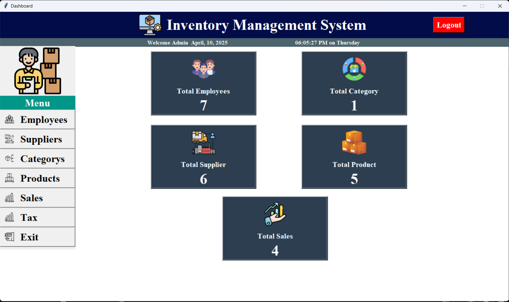
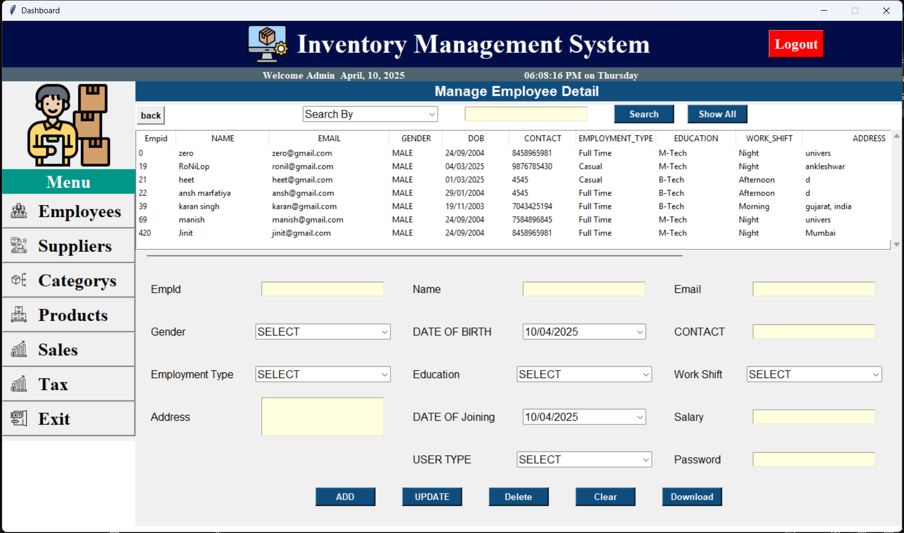
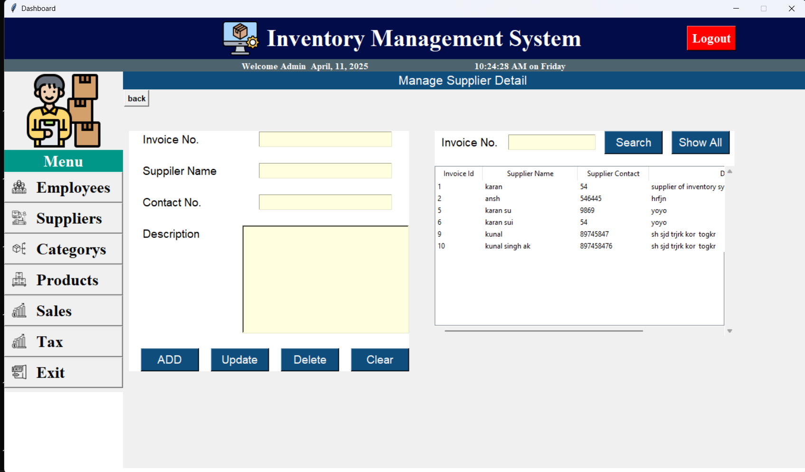
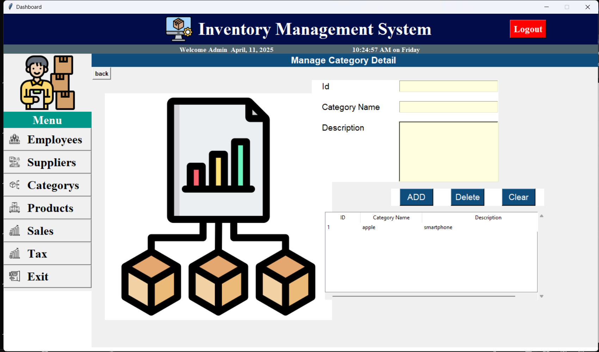
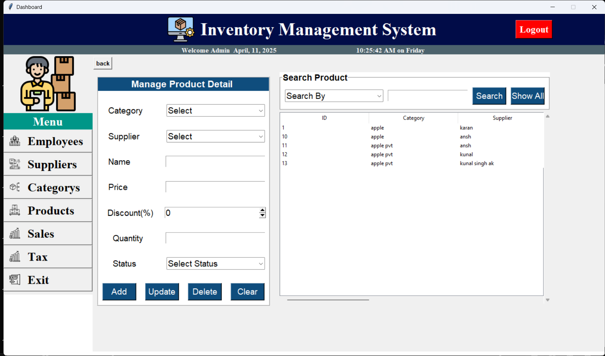
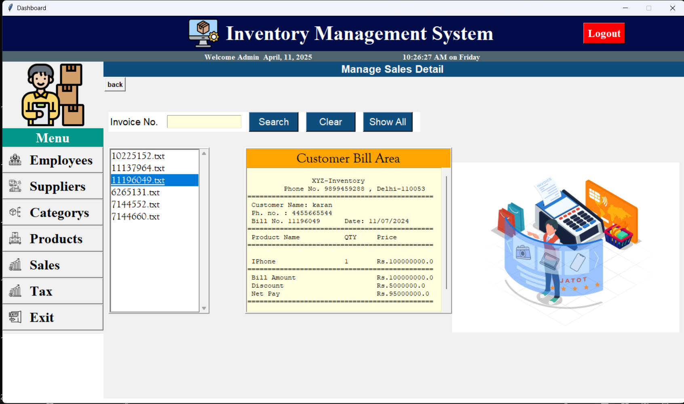
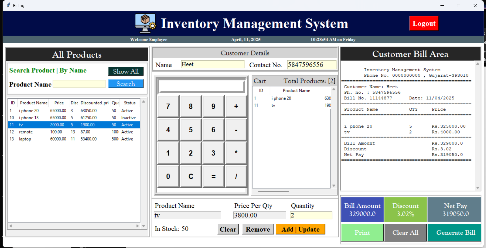
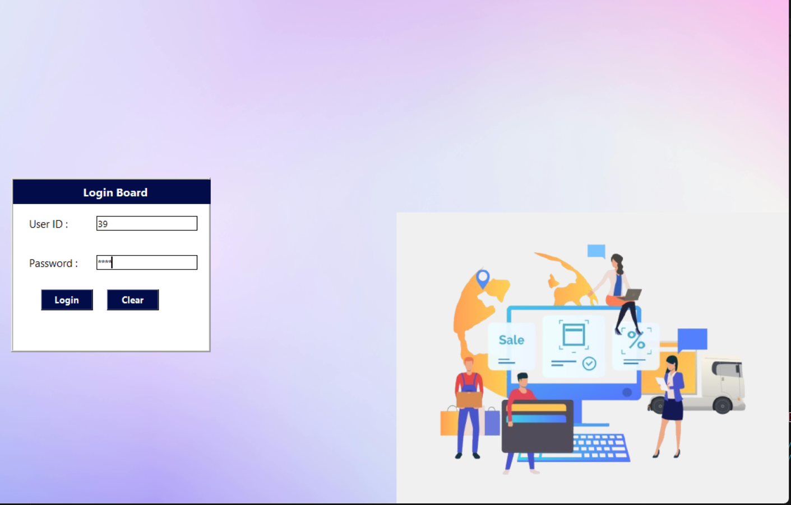

📦 Inventory Management System
A comprehensive Inventory Management System built using Python (Tkinter) and MySQL, designed to streamline retail or small business operations with features for both admins and employees.

## Author: Karan Singh

🔑 Features

- **Secure Login System**
  - Role-based login: **Admin** (access to dashboard) and **Employee** (access to billing)
- **Admin Dashboard**
  - Manage employees, products, suppliers, categories, and view sales data
- **Billing System**
  - Easy-to-use interface for employees to create bills and manage transactions
- **Product & Cart Management**
  - Add products to cart, calculate total, and generate sales entries
- **Database Integration**
  - Uses **MySQL** for backend data storage
- **Modular Design**
  - Each core functionality is handled in separate Python files

### 1. dashboard.py
- This script is the dashboard of Inventory Management System containing buttons, images and labels and timing.
- The screen shows the options for `Employee`, `Supplier`, `Category`, `Products` and `Sales` to perform CRUD operations.
- This screen also updates timely as you perform operations on any of these Labels.

### 2. employee.py
- This screen collects and shows the complete data regarding an `employee`.
- Buttons are functionalised accordingly.
- You can search an employee by its `email`, `name` or `contact`.

### 3. supplier.py
- This screen collects and shows the complete data regarding `suppliers`.
- Buttons are functionalised accordingly.
- You can search a particular supplier details by `invoice no`.

### 4. category.py
- This screen collects and shows the information about the category of the product. LIKE:- If Product name is `IPhone` then its category is `Phone`.
- This screen contains 2 buttons namely `add` and `delete`. These buttons are functionalised accordingly.

### 5. product.py
- This screen collects and shows the complete data about the `product`.
- It also ensures the `availability` of the product
- Buttons are functionalised accordingly.
- You can search a product by its `category`, `supplier` or `name`.

### 6. sales.py
- This screen stores and shows the bills by an `invoice no`.
- Buttons are functionalised accordingly.

### 7. billing.py
- This screen contains all the billing part.
- This screen contains information regarding the `products`, `customers`, `the products they are buying`, `billing structure`, `price of product`, `discout on the products`.
- This screen also contains a `calculator` to calculate the total amount.
- Buttons are functionalised accordingly.

### 8. login.py
- Role-based login: **Admin** (access to dashboard) and **Employee** (access to billing)

🛠️ Technologies Used
Python (Tkinter for GUI)
  - Tkinter (GUI)
  - PIL (Image handling)
  - OS & datetime modules
MySQL
PIL (for image handling)

### Pre-Requisites
Ensure that you have the following Python Pakages installed in your PC:
- `time`: `pip install time`
- `pil`: `pip install pil`
- `os`: `pip install os`

📁 Project Structure
inventory_system/
├── dashboard.py
├── employee.py
├── supplier.py
├── category.py
├── product.py
├── sales.py
├── billing.py
└── bill.txt

🚀 How to Run
Clone the repo
Ensure MySQL is installed and database is set up
Install required Python libraries
Run dashboard.py to start the system

🙌 Contributions
Feel free to fork the project, submit issues, or suggest new features.

📄 License
This project is open-source and free to use for educational purposes.
